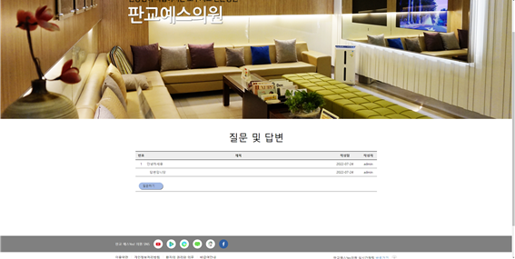
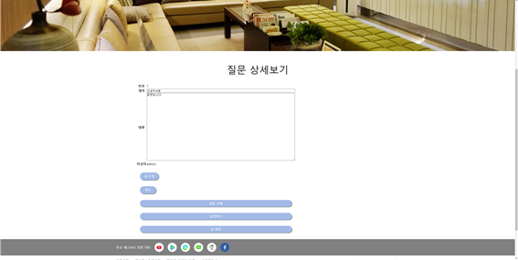
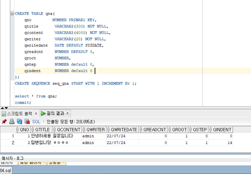
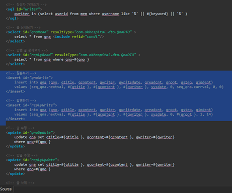
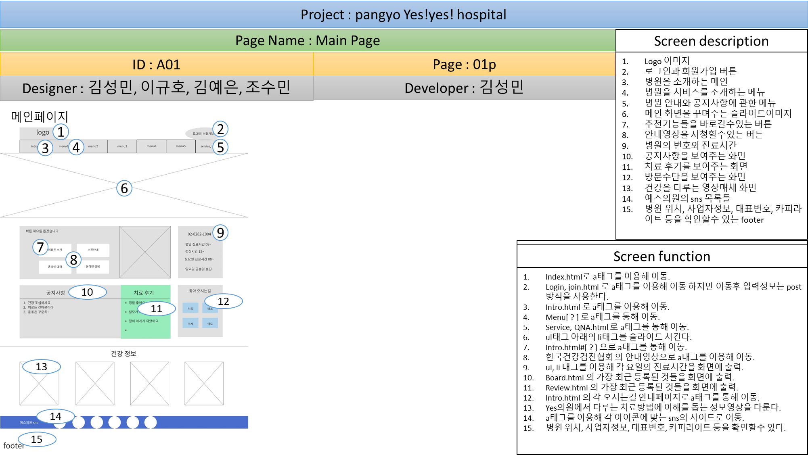
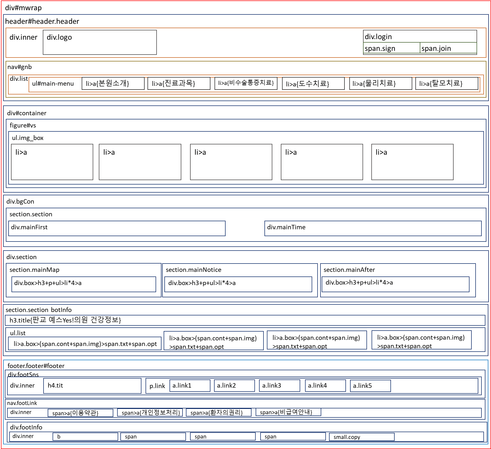

# 판교 예스 Yes 의원

병원 웹애플리케이션 프로젝트 입니다.

도수치료와 탈모를 중점으로 서비스를 제공하는 의원입니다.

# Description

- 개발 기간: 약 2주

- 참여 인원: Backend 4명

- 개발 도구
 
  - eclipse, visual studio code, spring studio

- 개발 환경

  - Spring 4.0 + Apache Tomcat 9.0 + Oracle11g_XE + Mybatis

- 사용 기술

  - Java,  Ajax,  Jquery,  Git,  Spring MVC

- 빌드 도구

  - maven

- 테스트 도구

  - jUnit4

- 담당 구현 파트

  - 프로젝트 개발환경 구축, 설계 참여

  - 메인 페이지 구현

  - Header 메인 메뉴 디자인 및 구성(검색)

  - Header, index, footer 페이지 구현(메뉴, 페이지 규격, 설계된 페이지 구현)

  - 각 게시판 및 QNA 기능 구현 (글쓰기, 상세보기, 글목록, 글수정, 글삭제, 글검색, 답변하기, 답변상세보기, 질문하기(글쓰기), 답변수정, 답변삭제)

  - 자료실 기능 구현 (파일 업로드, 업로드파일 저장, Ajax 파일업로드, 저장된 파일 보여주기)

  - GitHub 레포지토리 전체 관리

  - 팀원들의 프로젝트 스케줄 관리

- 사용 라이브러리

  - Inject.jar, Servlet.jar, junit.jar, spring-test.jar,
maven-war.jar, lombok.jar, log4jdbc.jar,
HikariCP.jar, spring-jdbc.jar
    

# Views

- **메인**

  

- **게시판 카테고리** 

  

- **상품 상세**

  

# Implementation

- #### 메인화면

  

  - **메뉴설정**

    1. Header, Menu, Footer 로 구성된 index 페이지

    2. 게시판에 등록되는 글중 최신글 5개를 메인페이지에 출력.

  - **서브메뉴**

    1. HTML, CSS를 이용해 구성.

------

- #### 회원 기능

  

  

  

  - **로그인, 회원가입, 회원목록, 마이페이지** 
    1. Spring MVC 를 이용했기에 Mapper 에서 SQL구문을 Controller에서 DAO와 Service에서 가져온 데이터를 View로 맵핑해주고 필요하다면 세션에 값을 저장하거나(로그인 등) DB에 저장할수없는 값을 주고받습니다.

 

------

- #### 게시판 기능

  

  - **글쓰기, 글보기, 글목록, 글수정, 글삭제**

    1. Spring MVC 를 사용한 특별할것 없는 평범한 게시판입니다 해당 프로젝트에서는 후기게시판으로 사용하고있습니다 기능구성은 평범하게 List, Read, insert, update, delete 등 이있으며 그외로는 Form 으로 맵핑해주는 정도 입니다.

------   

- #### QNA 기능

  

  
  
  
  

  
  - **목록 구현 기능**
    1. a태그에 의한 Get방식으로 호출된 경우.
    2. 검색 창(Form)에서 검색방법과 검색어를 입력받아 처리하는 POST방식의 경우.
  - **질문, 답변 기능**
    1. 하나의 테이블을 사용해 질문과 답변기능을 구현.
    2. 테이블의 column만을 사용해 질문과 답변을 나누고 묶어 정렬. 

<!-- 
- # Log 설정

       

# Trouble Shooting  -->

# 스케쥴 및 유즈케이스

  - **메인페이지와 메뉴 설계**
    -  제가 담당한 부분을 작성하기전 만들었던 설계들 입니다.

