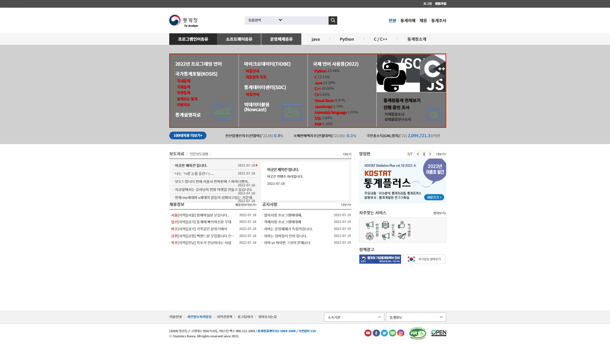
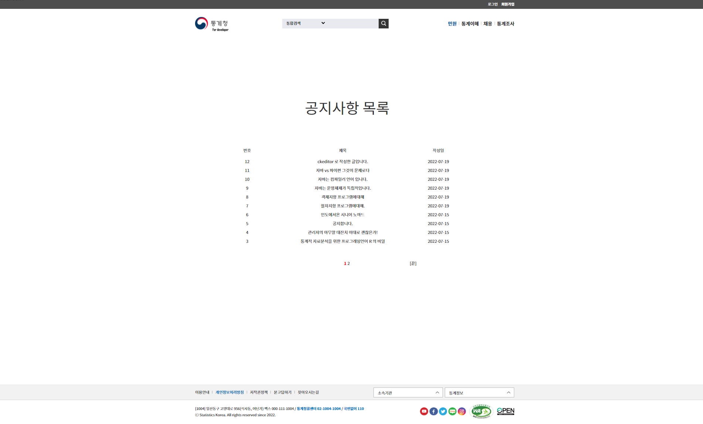
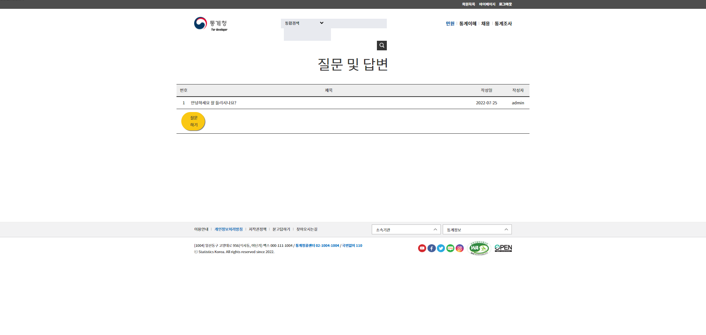
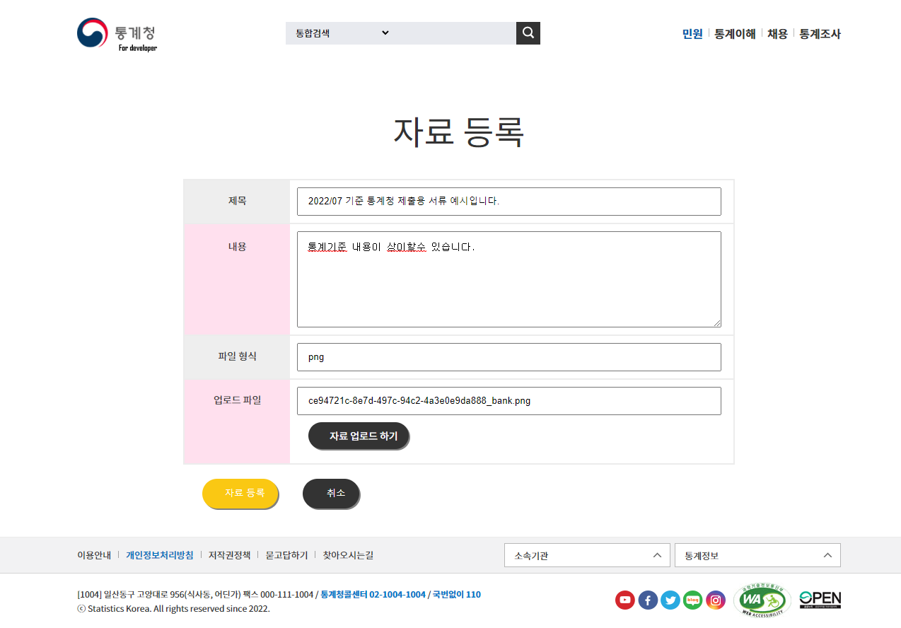

# 쇼핑몰 Discoveryvery

인터넷 쇼핑몰 구현 프로젝트 입니다.
캠핑용품 을 주제로 한 쇼핑몰 입니다.

# Description

- 개발 기간: 약 2주

- 참여 인원: 1명

- 개발 도구
 
  - eclipse, visual studio code, spring studio

- 개발 환경

  - Spring 4.0 + Apache Tomcat 9.0 + Oracle11g_XE + Mybatis

- 사용 기술

  - Java,  Ajax,  Jquery,  Git,  Spring MVC

- 빌드 도구

  - maven

- 테스트 도구

  - jUnit4

- 사용 라이브러리

  - Inject.jar, Servlet.jar, junit.jar, spring-test.jar,
  - maven-war.jar, lombok.jar, log4jdbc.jar,
  - HikariCP.jar, spring-jdbc.jar

# View
## 메인화면 - 최신공지 5개, 최신리뷰 5개 송출, 상품은 텐트만 구현
## 회원 - 로그인,로그아웃,회원가입,정보수정,회원목록
## 공지사항 - 목록, 상세, 수정, 작성, 삭제
## 리뷰 - 목록, 상세, 수정, 작성, 삭제
## QNA - 목록, 상세, 답글상세, 작성, 답글작성, 수정, 삭제
## 상품 - 목록, 카테고리별 목록, 작성, 수정, 삭제
## 장바구니 - 장바구니 넣기, 장바구니 물품 구매, 장바구니 내 상품 상세, 장바구니 내 상품 상세에서 구매, 삭제
## 결제 - 결제, 상세, 배송지 수정, 결제목록, 송장등록(관리자), 결제취소

# Views

- **메인**

  

- **게시판 카테고리** 

  

- **QNA 카테고리**

  

- **자료제출 카테고리**

  

# Implementation

- #### 메인화면

  

  - **메뉴설정**

    1. Header, Main, Footer 로 구성된 index 페이지.

    2. 최신 공지사항 과 리뷰 5개를 메인화면에 출력.

    3. 메인화면의 슬라이더를 조작하는 간단한 swiper.

  - **특이사항**

    1. 해당 프로젝트는 1주일의 시간동안 진행한 1인 프로젝트입니다 하나부터 열까지 순전히 제 힘으로 만들어져서 애착이 갑니다.
      또한 스프링의 프레임워크와 MVC 등 지금껏 배운것을 활용해볼수있는 좋은 기회였습니다 대표적으로 ajax와 io.file, loader 등

------

- #### 회원 기능

    

    

  

  - **로그인, 회원가입, 회원목록, 마이페이지** 
    1. Spring MVC 를 이용했기에 Mapper 에서 SQL구문을 Controller에서 DAO와 Service에서 가져온 데이터를 View로 맵핑해주고 필요하다면 세션에 값을 저장하거나(로그인 등) DB에 저장할수없는 값을 주고받습니다.

    2. 주소입력을 다음의 postcode 기능을 이용해 쉽게 작성할수 있도록 하였습니다.

 

------

- #### 게시판 기능

  

  - **글쓰기, 글보기, 글목록, 글수정, 글삭제**

    1. Spring MVC 를 사용한 특별할것 없는 평범한 게시판입니다 해당 프로젝트에서는 후기게시판으로 사용하고있습니다 기능구성은 평범하게 List, Read, insert, update, delete 등 이있으며 그외로는 Form 으로 맵핑해주는 정도 입니다.

------   

- #### QNA 기능

  

  
  

  
  - **목록 구현 기능**

    1. a태그에 의한 Get방식으로 호출된 경우.

    2. 검색 창(Form)에서 검색방법과 검색어를 입력받아 처리하는 POST방식의 경우.

  - **질문, 답변 기능**

    1. 하나의 테이블을 사용해 질문과 답변기능을 구현.

    2. 테이블의 column만을 사용해 질문과 답변을 나누고 묶어 정렬. 

------

- #### 상품 기능

  

  

  - **텐트 서브메뉴만 구성 되어 있음**

    1. 서브메뉴의 텐트상품의 종류는 리스트에서 카테고리별로 페이지를 열수있도록 했습니다.

    2. 상품을 클릭해 상세보기로 보시면 장바구니에 담기 와 바로 결제하기 가 있습니다.

------

- #### 장바구니 기능

  

  

  - **장바구니 내 상품 상세보기, 상품 구매하기 기능을 수행**

    1. 장바구니 내의 상품 이름을 클릭하시면 해당상품의 정보가 뜨게되는데 SQL 문의 INNER JOIN 을 사용해 goods의 상품과 basket의 등록번호를 묶어 가져올수 있도록 했습니다.

------

- #### 결제 기능

  

  

  

  

  - **결제와 관리자의 송장등록**

    1. 결제페이지입니다 수량 옆에 확정 버튼이 있는 이유는 제가 jQuery를 잘 모를때 작성을 한것이라 Java Script의 onclick 기능을 사용해서
    만들었습니다 지금이라면 jQuery를 이용해 만들것같습니다.

    2. 결제목록에서 결제정보를 클릭하면 배송지를 수정할수 있습니다.
    
    3. 관리자는 주문목록에서 해당 결제정보를 클릭하여 송장과 배송 상황을 입력할수 있습니다.

<!-- - # Log 설정 -->

       

# Trouble Shooting 

  

  

  

  

    1. 장바구니를 만들었을때 일어난 404에러입니다 콘솔로그 에 메시지가 뜨지않아 찾기 난감했지만 작성한것을 돌아보니 어노테이션을 작성하지 않아 일어난 문제였습니다.

    2. 똑 같은 에러가 발생시 수정 속도를 높이고자 결함 관리대장을 임시로 만들었습니다.

# 스케쥴 및 유즈케이스

  - **UI프로세스**
    - 설계당시 만든 UI프로세스입니다.

