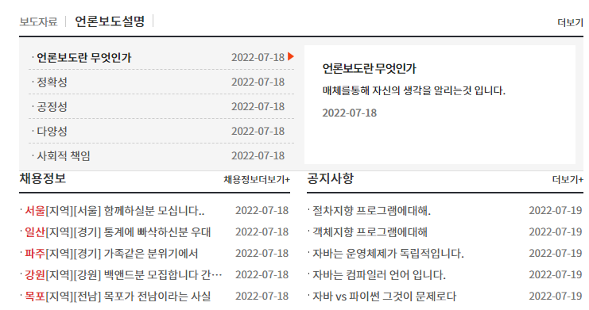
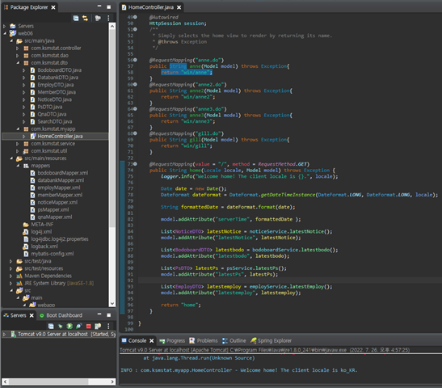
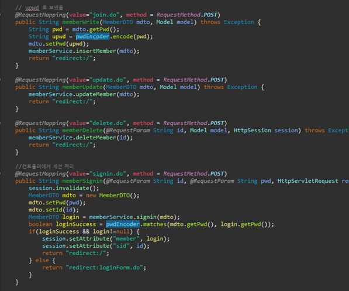
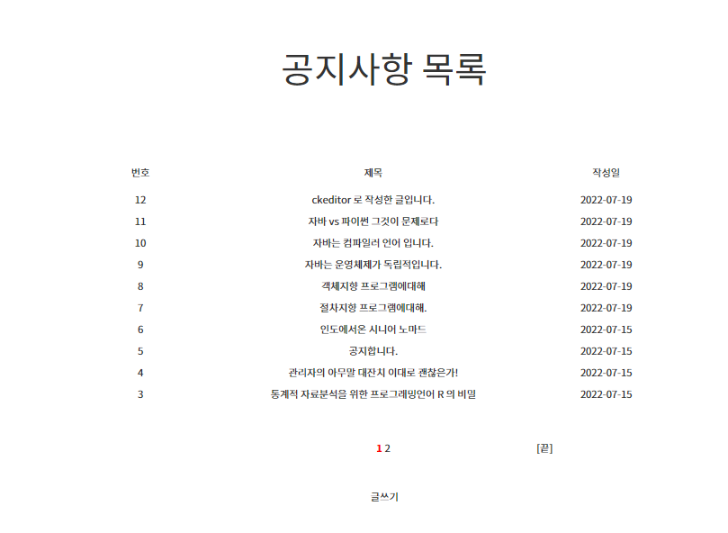
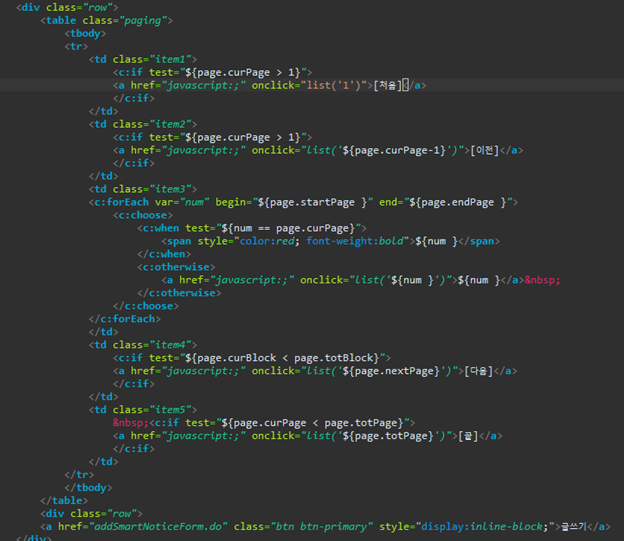
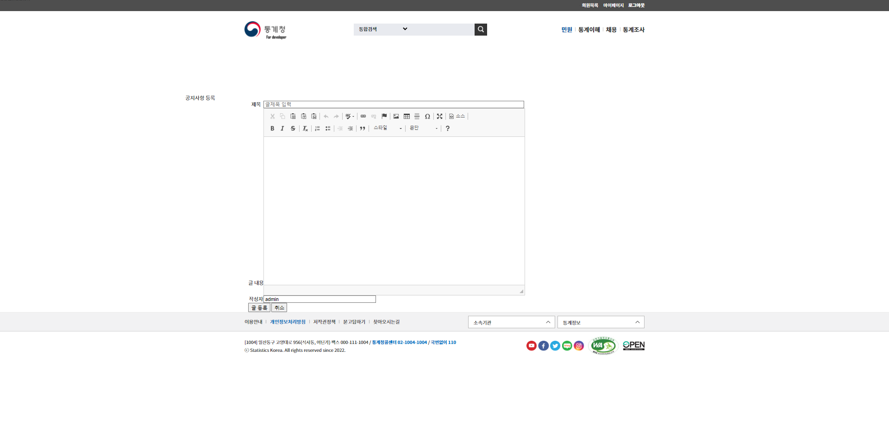
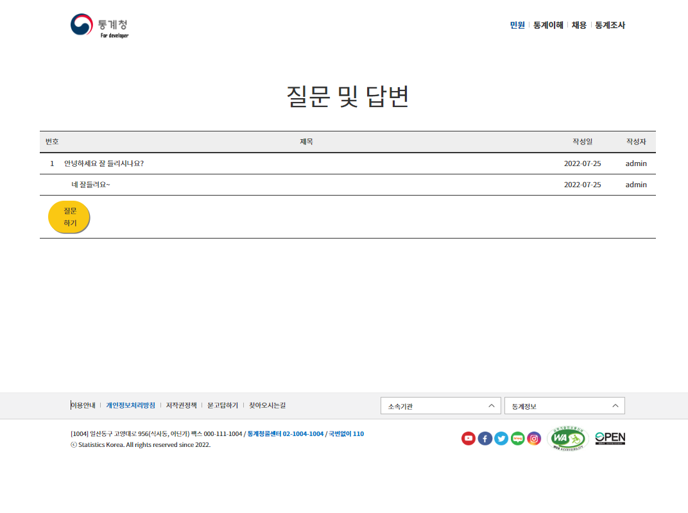
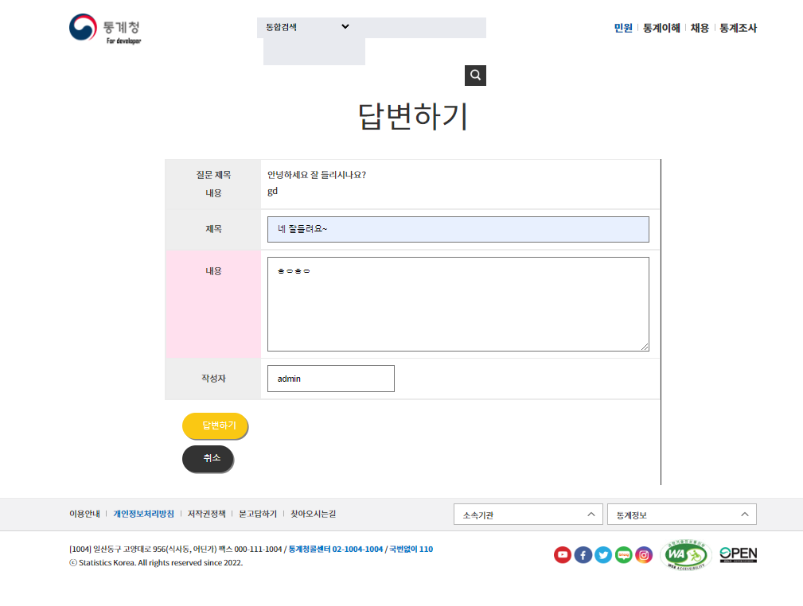
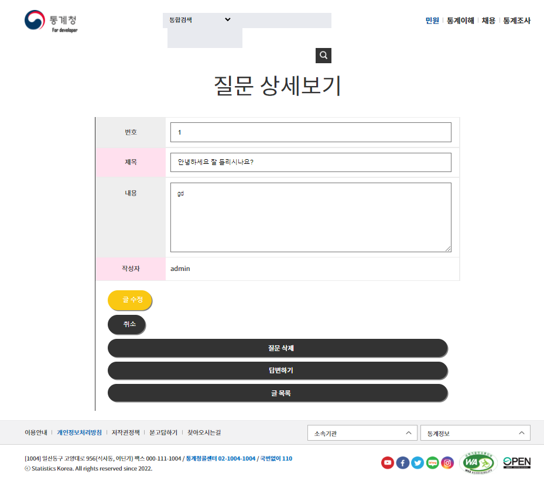

# 쇼핑몰 Discoveryvery

인터넷 쇼핑몰 구현 프로젝트 입니다.
캠핑용품 을 주제로 한 쇼핑몰 입니다.

# Description

- 개발 기간: 약 2주

- 참여 인원: 1명

- 개발 도구
 
  - eclipse, visual studio code, spring studio, bootstrap

- 개발 환경

  - Spring 4.0 + Apache Tomcat 9.0 + Oracle11g_XE + Mybatis

- 사용 기술

  - Java,  Ajax,  Jquery,  Git,  Spring MVC

- 빌드 도구

  - maven

- 테스트 도구

  - jUnit4

- 사용 라이브러리

  - Inject.jar, Servlet.jar, junit.jar, spring-test.jar,
  - maven-war.jar, lombok.jar, log4jdbc.jar,
  - HikariCP.jar, spring-jdbc.jar

# Views

- **메인**

  

- **게시판 카테고리** 

  

- **QNA 카테고리**

  

- **자료제출 카테고리**

  

# Implementation

- #### 메인화면

  

  

  - **메뉴설정**

    1. 메인메뉴에선 order by 를 작성 날짜로 limit를 5개 까지 허용하는 SQL문을 사용해 4개의 게시판이 최신글을 5개까지 출력하는 기능을 넣었습니다.

    2. HomeController 에서 Service.List 들을 불러와 뿌려준다면 전역적으로 값을 뿌릴수 있지않을까 생각했습니다.

------

- #### 회원 기능

  

  - **로그인, 회원가입, 회원목록, 마이페이지** 

    1. 통계청을 모티브로 한 사이트에 왜 회원기능이 있나? 라고 생각하실수도 있습니다.

    2. 그렇다고 이곳에 회원기능을 넣지 않으면 이 프로젝트만 확인하신 분께선 " 이녀석 회원기능은 기본인데 안넣었네" 라고 생각하실까봐 넣었습니다.

    3. security 라이브러리의 BCryptPasswordEncoder 를 import시켜 암호화를 사용중입니다.

 

------

- #### 게시판 기능

  

  

  

  - **(ckEditor)글쓰기, 글보기, (PageMaker)글목록, 글수정, 글삭제**

    1. list 에서  PageMaker를 사용해 글목록에 10개 묶음씩 페이지를 나눴습니다 해당 게시판의
    Controller에서 값을 변경시켜 묶음이나 페이지의 개수등을 설정할수있습니다.

    2. insert form은 ckEditor를 이용해 좀더 그럴듯하게 만들어 봤습니다.

    3. 이번 프로젝트에서 가장 힘을 써야겠다고 생각한 부분인 게시판이지만 pageMaker와 ckEditor 를 이용해 편리하게 작성했습니다 하지만 100% 전부 사용 할 수 있지는 않습니다 이번 프로젝트에선 이해하는데 그쳣지만 좀더 공부해 제것으로 만들 필요가 있습니다.

------   

- #### QNA 기능

  

  

  

  
  - **목록 구현 기능**

    1. a태그에 의한 Get방식으로 호출된 경우.

    2. 검색 창(Form)에서 검색방법과 검색어를 입력받아 처리하는 POST방식의 경우.

  - **질문, 답변 기능**

    1. 하나의 테이블을 사용해 질문과 답변기능을 구현.

    2. 테이블의 column만을 사용해 질문과 답변을 나누고 묶어 정렬. 

------

- #### 자료등록 기능

  

  

  
  - **자료등록, 상세보기**

    1. a태그에 의한 Get방식으로 호출된 경우.

    2. 검색 창(Form)에서 검색방법과 검색어를 입력받아 처리하는 POST방식의 경우.

<!-- - # Log 설정 -->

       

# Trouble

  

  

  

  

    1. 장바구니를 만들었을때 일어난 404에러입니다 콘솔로그 에 메시지가 뜨지않아 찾기 난감했지만 작성한것을 돌아보니 어노테이션을 작성하지 않아 일어난 문제였습니다.

    2. 똑 같은 에러가 발생시 수정 속도를 높이고자 결함 관리대장을 임시로 만들었습니다.

# 스케쥴 및 유즈케이스

  - **UI프로세스**
    - 설계당시 만든 UI프로세스입니다.

